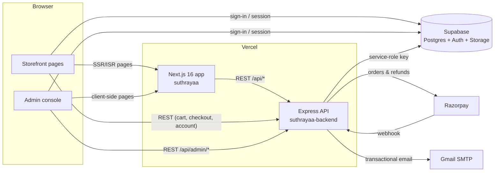

# Suthrayaa — project documentation

Suthrayaa is a handmade-crochet e-commerce site for the Indian market. It has two web portals, both served by the Next.js app in this repo, and one shared API:

| | Customer portal (storefront) | Admin portal (console) |
|---|---|---|
| URL space | `/`, `/shop`, `/product/*`, `/cart`, `/checkout`, `/account/*`, … | `/admin/*` |
| Users | Guests and signed-in customers | Staff with an admin account and RBAC roles |
| Architecture | [customer-portal/ARCHITECTURE.md](customer-portal/ARCHITECTURE.md) | [admin-portal/ARCHITECTURE.md](admin-portal/ARCHITECTURE.md) |
| Design system | [customer-portal/DESIGN.md](customer-portal/DESIGN.md) | [admin-portal/DESIGN.md](admin-portal/DESIGN.md) |

**API reference (Swagger):** `https://<backend>/api/docs`. The raw spec is at `/api/openapi.json`, and a copy lives in the backend repo at `docs/openapi.json` (regenerate it with `npm run docs:openapi`).

---

## System overview



| Layer | Tech | Repo |
|---|---|---|
| Web app (both portals) | Next.js 16 (App Router), React 19, Tailwind CSS 4, Radix/shadcn UI, framer-motion, zustand | `suthrayaa` |
| API | Node 20+, Express 4, zod validation, pino logging | `suthrayaa-backend` |
| Data, auth, files | Supabase: Postgres with RLS, Supabase Auth (email/password + Google), Storage buckets | — |
| Payments | Razorpay (UPI, cards, net banking) + Cash on Delivery | — |
| Email | Nodemailer over Gmail SMTP; admin-editable HTML templates stored in the database | — |
| Invoices | GST-compliant PDF invoices rendered with pdfkit | — |
| Hosting | Two Vercel projects (frontend and backend) | — |

### Key principles

1. **The API is the only thing that writes business data.** The browser uses Supabase only for sign-in and sessions. All catalogue, order, account and admin data goes through the Express API, which talks to Postgres with the service-role key. RLS policies exist as a second line of defence.
2. **The server recomputes every price.** The cart sends product IDs, selections and quantities, never prices. `validate-cart` and `place-order` re-price everything: customization surcharges, coupons, shipping zones and GST.
3. **RBAC is checked on every admin request**, against the database, not a JWT claim. Revoking a role or deactivating an admin takes effect immediately.
4. **Admins can change what shoppers see without a deploy.** Site settings (about 150 keys), Storefront Content blocks (section copy, About, FAQs, policy pages, …), navigation, footer links, homepage sections, hero slides, testimonials and email templates all live in the database. See [what admins control](admin-portal/ARCHITECTURE.md#what-admins-control-on-the-storefront).

### Backend layout (`suthrayaa-backend/src`)

```
app.ts               Express app: security middleware, route mounting, docs, error handling
server.ts            Local / long-running Node entry (app.listen) — Vercel uses app.ts's default export
config/              env (zod-validated), supabase admin client, razorpay client
middleware/          authenticate, requireAdmin, requirePermission, validate, rate limiters, errors
modules/
  catalog/           public products, categories, colors, reviews, testimonials, hero slides
  checkout/          cart pricing, order placement, Razorpay verification
  content/           Storefront Content catalog + /api/content, newsletter signups
  customers/         /api/me — profile, addresses, orders, cart & wishlist sync, invoices
  admin/             /api/admin/* — one routes file per console area
  rbac/              permission + role catalogs, evaluation, audit log
  settings/          site settings catalog + cache, GST/tax, shipping zones, India data
  email/             templated email service + branded shell
  invoices/          invoice numbering, snapshot, PDF rendering
  storage/           image upload (sharp → webp) to Supabase Storage
  webhooks/          Razorpay webhook, MSG91 SMS hook
docs/openapi.ts      OpenAPI generator (from the live route table) + Swagger UI page
```

### Data model (main tables)

| Area | Tables |
|---|---|
| Catalogue | `products`, `product_images`, `categories` (3-level tree via `parent_id`), `product_categories`, `colors`, `product_colors`, `tax_categories` |
| Customization | `product_customizations` (option groups), `customization_values`, `customization_templates`, `customization_template_values` (legacy: `customization_rules`, `customization_allowed_colors`) |
| Customers | `customer_profiles` (auto-created by the `on_auth_user_created` trigger), `addresses`, `cart_items`, `wishlist_items`, `reviews` |
| Orders | `orders`, `order_items` (price/name snapshots), `order_status_history`, `coupons`, `coupon_redemptions`, `invoices`, `invoice_settings`, number counters |
| Content | `site_settings`, `page_content` (Storefront Content blocks), `nav_items`, `footer_links`, `homepage_sections`, `hero_slides`, `testimonials`, `email_templates`, `email_logs`, `newsletter_subscribers` |
| Admin & RBAC | `admin_users`, `admin_invites`, `roles`, `permissions`, `role_permissions`, `user_roles`, `audit_logs` |

**Order status:** `pending_payment → confirmed → in_production → ready → shipped → delivered`. It can also move to `cancelled` or `refunded` along the way. **Payment status:** `pending | paid | failed | refunded | partially_refunded`.

**Database setup:** a fresh Supabase project is created from `suthrayaa-backend/supabase/final_schema.sql` in one run. That file is the verified equivalent of migrations `0001–0015`. After running it, run `npm run seed:rbac` and `npm run create:admin`. For the existing database, add new numbered migrations; don't re-run the final script.

### Environments and deployment

| Variable | Where | Purpose |
|---|---|---|
| `NEXT_PUBLIC_API_URL` | frontend | Backend base URL including `/api` |
| `NEXT_PUBLIC_SUPABASE_URL`, `NEXT_PUBLIC_SUPABASE_ANON_KEY` | frontend | Supabase Auth in the browser and in `proxy.ts` |
| `SUPABASE_URL`, `SUPABASE_SECRET_KEY`, `SUPABASE_PUBLISHABLE_KEY`, `SUPABASE_JWKS_URL` | backend | DB access and JWT verification |
| `RAZORPAY_KEY_ID`, `RAZORPAY_KEY_SECRET`, `RAZORPAY_WEBHOOK_SECRET` | backend | Payments and the webhook signature |
| `GMAIL_USER`, `GMAIL_APP_PASSWORD`, `ADMIN_NOTIFICATION_EMAIL` | backend | Transactional email |
| `FRONTEND_URL` | backend | CORS origin (no trailing slash) and links in emails |
| `NODE_ENV=production`, `TRUST_PROXY=1`, `NODEJS_HELPERS=0` | backend (Vercel) | Production mode, real client IPs for rate limits, raw body for the webhook |
| `API_DOCS=off` | backend (optional) | Hides `/api/docs` and `/api/openapi.json` |

The backend runs on Vercel as a single serverless function (`vercel.json` → `src/app.ts`). Work that continues after the response is sent (emails, invoice generation) is wrapped in `background()` (`@vercel/functions` `waitUntil`), so it isn't cut off when the function freezes.
