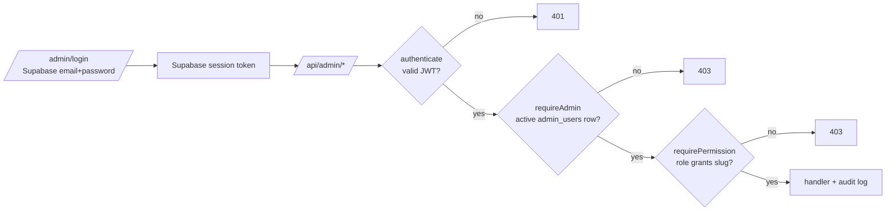

# Admin portal — architecture

The admin console at `/admin` is where staff run the store: catalogue, orders, customers, content, emails, settings and staff access. It lives in the same Next.js app as the storefront, but it's entirely client-rendered and talks to the `/api/admin/*` routes. For the system overview and data model, see [../README.md](../README.md).

## Access model



- **Admins are Supabase Auth users** with an active `admin_users` row. New staff join through an invite: Admin → Users & Roles sends an email with a link to `/admin/register/[token]`.
- **RBAC:** `roles` ↔ `role_permissions` ↔ `permissions`, assigned via `user_roles`. Permission slugs are `resource.action` (e.g. `orders.update`, `settings.tax`).
- **Checked on every request.** The backend loads permissions from the database each time, so revoking access takes effect immediately. **Super Admin** bypasses all checks, and the API refuses to remove or demote the last active Super Admin.
- **Privilege-escalation guard:** an admin can only grant permissions they hold themselves.
- **Hiding UI is not security.** The frontend's `ProtectedRoute` (page) and `<Can permission>` (buttons) only hide things; the API is the authority.
- **Audit log:** sensitive actions (users, roles, products, orders, settings, content) are written to `audit_logs` and shown in Admin → Audit Logs.

### System roles (seeded by `npm run seed:rbac`)

| Role | Scope |
|---|---|
| Super Admin | Everything |
| Catalog Manager | Products, images, categories, colours, inventory |
| Order Manager | Orders, customers (view/update), shipping settings |
| Content Manager | Content, banners, storefront settings |
| Marketing Manager | Coupons, analytics |
| Support Agent | View orders, update customers, moderate reviews |
| Viewer | Read-only catalogue, orders, customers, analytics |

Custom roles are built in Admin → Users & Roles → Roles.

## Console map

| Area | Route | Permission (view) | Backend |
|---|---|---|---|
| Dashboard | `/admin` | `analytics.view` | `/api/admin/analytics` |
| Products | `/admin/products`, `/new`, `/[id]` | `products.view` | `/api/admin/products` (+ images, customization groups) |
| Categories | `/admin/categories` | `categories.view` | `/api/admin/categories` |
| Colors | `/admin/colors` | `colors.view` | `/api/admin/colors` |
| Option Templates | `/admin/customization-templates` | `products.view` | `/api/admin/customization-templates` |
| Orders | `/admin/orders`, `/[id]` | `orders.view` | `/api/admin/orders` (status, tracking, invoice, refund) |
| Coupons | `/admin/coupons` | `coupons.view` | `/api/admin/coupons` |
| Customers | `/admin/customers`, `/[id]` | `customers.view` | `/api/admin/customers` |
| Storefront Content | `/admin/storefront-content` | `content.view` | `/api/admin/content` |
| Product Reviews | `/admin/reviews` | `reviews.view` | `/api/admin/reviews` |
| Testimonials | `/admin/testimonials` | `content.view` | `/api/admin/testimonials` |
| Hero Slides | `/admin/hero-slides` | `banners.view` | `/api/admin/hero-slides` |
| Email Templates / Logs | `/admin/emails/*` | `emails.view` | `/api/admin/emails` |
| Newsletter | `/admin/newsletter` | `customers.view` | `/api/admin/newsletter` |
| Users & Roles | `/admin/users`, `/admin/roles` | `users.view` / `roles.view` | `/api/admin/users`, `/roles`, `/permissions`, `/invites` |
| Audit Logs | `/admin/audit-logs` | `audit_logs.view` | `/api/admin/audit-logs` |
| Theme | `/admin/theme` | `settings.view` (apply/edit: `settings.branding`) | `/api/admin/theme` |
| Site Settings | `/admin/settings` | `settings.view` (+ per-tab slugs) | `/api/admin/settings` (+ tax categories, shipping zones, nav, footer links, homepage sections) |
| Invoice Settings | `/admin/settings/invoice` | `settings.view` | `/api/admin/settings/invoice` (live PDF preview) |

The sidebar is built from the `NAV` config in `app/admin/(dashboard)/layout.tsx`. Items the admin lacks permission for are hidden, and the command palette (⌘K) searches the same list.

## What admins control on the storefront

Admins can change everything a shopper sees without a deploy:

| Storefront element | Admin location |
|---|---|
| Homepage section order, on/off, headings and links | Site Settings → Homepage |
| Section bodies, About, FAQs, policy pages, header perks, page images, footer extras | Storefront Content |
| Hero carousel | Hero Slides (with image upload) |
| Storefront colour theme (7 ready-made themes + custom themes) | Theme |
| Announcement bar, navigation, footer links and description, logo, favicon, SEO, social, contact details, maintenance mode, checkout rules, GST, shipping zones, payment methods | Site Settings tabs |
| Products, categories, colours, customization options | Catalogue pages |
| Testimonials, reviews, coupons | Their pages |
| Every transactional email | Email Templates (HTML with `{{variables}}`) |
| Invoice look and legal details | Invoice Settings |

**Propagation:** edits reach the live site within about a minute. The backend settings and content caches have a 60s TTL, and storefront pages use 60s ISR.

## Code layout

```
app/admin/
  login/, register/[token]/     auth screens (AuthShell)
  (dashboard)/layout.tsx        RbacProvider, sidebar NAV, theme toggle (light/dark), command palette
  (dashboard)/<area>/page.tsx   one client page per area
components/admin/
  page-header.tsx               standard title/description/actions row — every page uses it
  protected-route.tsx, can.tsx  permission gating (UX only)
  product-form.tsx, customization-editor.tsx, category-manager.tsx
  content-fields-form.tsx       schema-driven editor for Storefront Content blocks
  settings-group-form.tsx       schema-driven editor for Site Settings groups
  homepage-sections-panel.tsx, nav-items-panel.tsx, footer-links-panel.tsx
  status-dot.tsx, stat-card.tsx, sortable-th.tsx, data-table-pagination.tsx, segmented-control.tsx, …
lib/api/admin.ts, rbac.ts, settings.ts   typed clients (adminFetch adds the bearer token, no caching)
lib/rbac/rbac-context.tsx      loads /admin/me → roles, permissions; hasPermission()
lib/hooks/use-sortable-data.ts, use-paginated.ts   client-side table helpers
```

## Order lifecycle (admin side)

`pending_payment → confirmed → in_production → ready → shipped → delivered`. Orders can also move to `cancelled` or `refunded`.

- **Status emails:** each move sends the matching email template (`order_confirmed`, `order_making`, `order_ready`, `order_shipped`, `order_delivered`, `order_cancelled`, plus `refund_processed` when a paid order is cancelled or refunded).
- **Tracking and manual emails:** tracking numbers and carrier details are saved on the order. From the order page, an admin can send any lifecycle email on demand (`POST /api/admin/orders/:id/send-email`), e.g. `order_tracking_updated` after adding tracking, or a resend.
- **Invoices:** generated automatically once an order is placed or paid, numbered with the invoice prefix plus a sequential database counter (`next_invoice_number`). Admins can download them or email them (`invoice_email`).
- **Background work:** emails run as background tasks (`waitUntil` on Vercel), so the admin's request stays fast.

## Adding an admin feature

1. **Backend:**
   - Add a routes file in `suthrayaa-backend/src/modules/admin/`, using `authenticate, requireAdmin` at router level and `requirePermission('<slug>')` per route.
   - Validate bodies with `validate(zodSchema)`; this also documents them in Swagger automatically.
   - If you need a new permission, add it to `permissions.catalog.ts` and grant it to roles in `roles.catalog.ts`, then run `npm run seed:rbac`.
2. **Frontend:**
   - Add the typed calls to `lib/api/admin.ts`.
   - Create `app/admin/(dashboard)/<area>/page.tsx` wrapped in `<ProtectedRoute permission>`, starting with `<PageHeader>`.
   - Add an entry to `NAV` in the dashboard layout.
3. **Audit:** call `logAudit()` for anything destructive or security-relevant.
