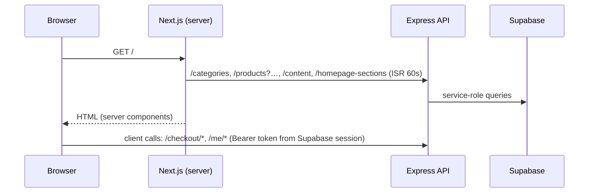

# Customer portal — architecture

The storefront is where shoppers browse, customise, pay and track orders. It's the public half of the Next.js app. For the overall system, backend and data model, see [../README.md](../README.md).

## Route map

| Route | Rendering | What it does |
|---|---|---|
| `/` | Server, ISR 60s | Homepage. Sections, order and headings come from Admin → Site Settings → Homepage; section bodies from Storefront Content |
| `/shop` | Server data + client filtering | Full catalogue (all pages fetched); category, tag, search, price and sort filters run in the browser |
| `/product/[slug]` | Server, dynamic | Product detail, customizer, reviews and the "Write a review" form, related products |
| `/cart`, `/wishlist` | Client | zustand stores (localStorage); synced to the account when signed in |
| `/checkout` | Client | Address, shipping method, coupon, gift wrap, COD or Razorpay |
| `/order-confirmation` | Server, dynamic | Order summary after placing an order; retry payment for unpaid online orders |
| `/login`, `/auth/callback` | Client / route handler | Supabase email + password, Google OAuth, password reset |
| `/account/*` | Client, sign-in required | Profile, addresses, orders (cancel, pay, invoice PDF), security |
| `/about`, `/faqs`, `/contact` | Server, ISR | Content from Storefront Content; contact details from Site Settings |
| `/shipping`, `/returns`, `/refund-policy`, `/privacy`, `/terms` | Server, ISR | `PolicyPage`, rendered from Storefront Content |

A **maintenance mode** (Admin → Site Settings → Maintenance) replaces every storefront page with `MaintenancePage` via `StoreSettingsGate`. `/admin` is never gated.

## Code layout

```
app/                     routes (App Router); pages are thin: fetch, then compose components
components/
  home/                  homepage sections (one component per section key)
  ui/                    shadcn/Radix primitives (button, dialog, sheet, select, …)
  motion/                Reveal / Stagger / YarnDivider animation helpers
  content-text.tsx       AccentText (*accent* headings), Markdown (policy/FAQ text), ContentIcon
  policy-page.tsx        shared renderer for the five policy pages
  newsletter-signup.tsx  footer + homepage newsletter card (stores signups)
  account-sync.tsx       cart/wishlist ⇄ account sync for signed-in shoppers
  review-form.tsx        "Write a review" dialog
lib/
  api/http.ts            apiFetch: fetch wrapper (bearer token, ISR hint, typed ApiError)
  api/*.ts               endpoint clients (account, checkout, contact, settings, …)
  data.ts                catalogue reads (products, categories, reviews, testimonials, slides)
  content.ts             Storefront Content types + getSiteContent / getContentBlock
  store.ts               zustand cart + wishlist (persisted)
  store-contact.ts       store email/phone/WhatsApp/address from Site Settings
  supabase/              browser + server Supabase clients
proxy.ts                 refreshes the Supabase session cookie on every request
```

## Data flow



- **Server components** fetch through `apiFetch` with `revalidate: 60` (ISR). An admin edit shows on the storefront within about a minute: the backend content and settings caches have a 60s TTL, and the pages revalidate every 60s.
- **Client components** call the API directly, with the Supabase access token when signed in.
- **Fallbacks:** every content-driven component keeps its original copy as a `FALLBACK`, used only when the API is unreachable, so a backend hiccup never produces a blank section.

## Storefront content (CMS)

| Where it's edited (admin) | Drives |
|---|---|
| Site Settings → Homepage | Which sections show, their order, and each section's eyebrow, title (`*accent*`), description and link |
| Storefront Content | Trust badges, promo and coupon, story, reels, feature showcase, Instagram, About, FAQs, contact page text, the five policy pages, header perks and page images, footer extras |
| Site Settings (other tabs) | Store contact details, social links, SEO, announcement bar, footer links, branding colours, logo, favicon |
| Products, Categories, Colors, Hero Slides, Testimonials, Coupons, Reviews | Their own pages |

To add a new editable block:

1. Add it to `suthrayaa-backend/src/modules/content/content.catalog.ts` with its fields and defaults.
2. Add its type to `lib/content.ts`.
3. Read it with `getSiteContent()` or `getContentBlock()` in the component.

The admin editor builds its form from the catalog automatically.

## Key flows

### Cart → checkout → payment

1. **Add to cart:** stored locally (zustand, persisted). Each line is keyed by product + colour + custom text + customization selections.
2. **Checkout:** `POST /checkout/validate-cart` re-prices everything on the server: customization surcharges, coupon, shipping zone (by state), GST and gift wrap.
3. **Place the order:** `POST /checkout/place-order` with an `idempotencyKey`.
   - **COD:** the order is confirmed immediately.
   - **Razorpay:** the API returns a Razorpay order; the browser opens Razorpay Checkout; on success, `POST /checkout/verify-payment` checks the signature. The Razorpay webhook (`payment.captured` / `order.paid`) is a backstop if the tab closes.
4. **Stock:** stock-tracked items are decremented atomically in the database (`decrement_product_stock`).
   - **COD:** stock is reserved when the order is placed, and the order is rejected if any line is short.
   - **Online:** stock is reserved once payment is confirmed. The money is already taken, so a shortfall is logged for the team to handle rather than failing the order.
   - **Then:** the invoice is generated, and the customer and admin emails go out as background tasks.
5. **Confirmation:** `/order-confirmation?order=…` shows the order. `useCartStore.clearCart()` empties the cart, and that sync clears the account copy too.

### Accounts

- **Sign-in:** Supabase Auth, either email + password or Google (redirects through `/auth/callback`). `safeRedirectPath` sanitises `?redirect=` and `?next=`, so only same-site paths are followed.
- **Profile row:** a database trigger creates `customer_profiles` on sign-up.
- **Signed-in cart and wishlist:** `AccountSync` merges the local cart and wishlist with the account on sign-in (a line in both keeps the larger quantity), then pushes changes with `PUT /me/cart` and `PUT /me/wishlist` in replace mode. Sign-out clears the local copies.
- **Orders:** customers can cancel while an order is `pending_payment` or `confirmed` (not once production has started), retry payment on unpaid online orders, and download a GST invoice PDF.

### Reviews

- **Writing:** signed-in customers submit reviews from the product page (`POST /reviews`, one per product per customer, rate-limited). A review is marked "verified" when the customer has a paid order containing the product.
- **Publishing:** reviews start unpublished. Once an admin publishes one in Admin → Product Reviews, a database trigger recomputes the product's `rating` and `review_count`.

### Newsletter

The footer card, and the optional homepage section, `POST /newsletter`. Signups are idempotent and never reveal whether an address already exists. Subscribers are listed and exported (CSV) in Admin → Newsletter.

## Environment

| Variable | Purpose |
|---|---|
| `NEXT_PUBLIC_API_URL` | Backend base URL, including `/api` |
| `NEXT_PUBLIC_SUPABASE_URL`, `NEXT_PUBLIC_SUPABASE_ANON_KEY` | Supabase Auth |

`.env.local` points at `localhost:5000` for development. The production values are set in the Vercel project.

## Conventions

- **Server components by default.** Mark a file `'use client'` only when it needs state, effects or browser APIs.
- **Price and sell data always comes from the API.** Never trust client-side prices; the cart shows estimates and checkout re-prices on the server.
- **Keep hardcoded copy as fallbacks only.** User-facing marketing copy belongs in Storefront Content; the original copy stays in the component only as the `FALLBACK`.
- **Respect `prefers-reduced-motion`.** Motion components check `useReducedMotion()`; keep it that way.
